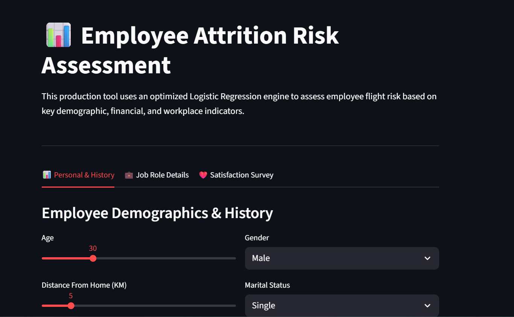
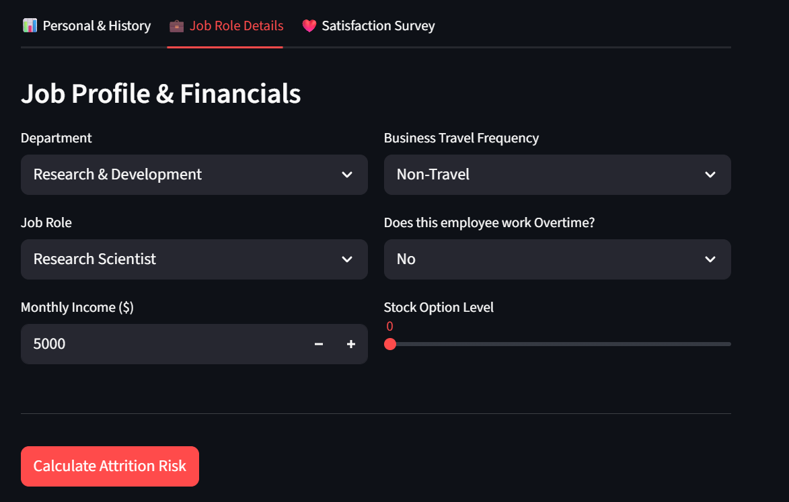

# 📊 Employee Attrition Risk Assessment Dashboard

An interactive, production-ready web application built with **Streamlit** that leverages machine learning to predict employee attrition risk. The application enables HR professionals and business stakeholders to assess the likelihood of employee turnover using key workforce, performance, and satisfaction indicators.
<table>
  <tr>
    <th>Photo 1</th>
    <th>Photo 2</th>
  </tr>
  <tr>
    <td></td>
    <td></td>
  </tr>
</table>
The system transforms user-provided HR data into a production-ready feature schema, applies the same preprocessing pipeline used during model training, and generates a real-time attrition risk prediction powered by a trained **Logistic Regression model**.

Unlike traditional accuracy-focused solutions, this project prioritizes **Recall**, ensuring that potential flight-risk employees are identified as early as possible. This approach supports proactive retention strategies and minimizes the business impact associated with unexpected employee departures.

---

## 🎯 Project Objective

Employee attrition represents a significant challenge for organizations due to recruitment costs, onboarding expenses, productivity losses, and knowledge transfer gaps.

The goal of this project is to:

* Identify employees who may be at risk of leaving.
* Support proactive HR intervention strategies.
* Provide a user-friendly interface for non-technical stakeholders.
* Demonstrate an end-to-end machine learning deployment workflow.

The application bridges the gap between model development and practical business usage by transforming a trained machine learning model into an accessible decision-support tool.

---

## 🚀 Features

### 📋 Three-Tier Input Architecture

Employee information is organized into intuitive sections for improved usability:

#### Personal & Employment History

* Age
* Gender
* Marital Status
* Distance From Home
* Total Working Years
* Years at Company
* Years Since Last Promotion
* Business Travel

#### Job & Compensation Information

* Job Role
* Department
* Job Level
* Monthly Income
* Overtime Status
* Stock Option Level

#### Satisfaction & Performance Metrics

* Job Satisfaction
* Environment Satisfaction
* Relationship Satisfaction
* Work-Life Balance
* Performance Rating

---

### ⚙️ Production-Ready Data Pipeline

The dashboard replicates the exact preprocessing workflow used during model training.

Key capabilities include:

* Automatic categorical value mapping
* Dynamic one-hot encoding using `pd.get_dummies()`
* Feature alignment using saved training schema
* Missing column handling through reindexing
* Consistent numerical feature scaling
* Model-ready data transformation in real time

This ensures prediction consistency between training and deployment environments.

---

### 🤖 Machine Learning Prediction Engine

The dashboard uses a trained **Logistic Regression classifier** selected after evaluating multiple candidate models.

Models evaluated:

* Logistic Regression
* Random Forest
* XGBoost

The final model was selected because it achieved the highest **Recall**, making it the most effective model for identifying employees who ultimately left the organization.

#### Why Recall?

In employee attrition prediction:

* **True Positive:** Correctly identifies an employee who leaves.
* **False Negative:** Fails to identify an employee who leaves.

Because missing a flight-risk employee can be costly, maximizing Recall was prioritized over maximizing Accuracy alone.

Model Evaluation Summary:

| Model               | Accuracy | Recall     | Precision  | F1-Score   |
| ------------------- | -------- | ---------- | ---------- | ---------- |
| Logistic Regression | 77.55%   | **70.21%** | 39.00%     | **50.00%** |
| Random Forest       | 80.61%   | 53.19%     | 42.00%     | 46.73%     |
| XGBoost             | 81.63%   | 57.45%     | **44.00%** | **50.00%** |

As a result, Logistic Regression was selected as the production model due to its superior ability to identify employees at risk of attrition.

---

## 📈 Risk Assessment Interface

The application provides an intuitive risk analysis experience through:

### 🟢 Low Risk

Employees showing strong retention indicators and low predicted probability of attrition.

### 🟡 Moderate Risk

Employees displaying some risk factors that may warrant monitoring or engagement initiatives.

### 🔴 High Risk

Employees exhibiting multiple attrition indicators and a high likelihood of leaving the organization.

Each prediction includes:

* Attrition probability score
* Color-coded risk classification
* Visual risk progress bar
* Employee profile summary card

This allows HR teams to quickly interpret model outputs and prioritize retention efforts.

---

## 🛠️ Technology Stack

* Streamlit
* Pandas
* Scikit-learn
* Logistic Regression
* StandardScaler


---

## 📂 Project Structure

```text
├── a.py                      # Main Streamlit application script
├── attrition_model.pkl       # Trained Logistic Regression model
├── numerical_scaler.pkl      # Saved StandardScaler object
├── model_features.pkl        # Training feature schema
├── .gitignore                # Ignore cache and local files
└── README.md                 # Project documentation
```

---

## ⚡ Installation

Clone the repository:

```bash
git clone https://github.com/yourusername/employee-attrition-dashboard.git
cd employee-attrition-dashboard
```

Install dependencies:

```bash
pip install -r requirements.txt
```

Run the Streamlit application:

```bash
streamlit run a.py
```

---

## 🔍 Workflow Overview

1. User enters employee information through the dashboard.
2. Data is converted into the required machine learning format.
3. Categorical features are encoded.
4. Numerical features are standardized using the saved scaler.
5. Features are aligned with the original training schema.
6. The Logistic Regression model generates an attrition probability.
7. Results are displayed through a visual risk assessment interface.

---

## 💡 Business Value

This project demonstrates how machine learning can support human resource decision-making by:

* Improving employee retention planning
* Reducing turnover-related costs
* Identifying workforce risk patterns
* Supporting data-driven HR strategies
* Translating predictive analytics into actionable insights

---

## 📜 Disclaimer

This application is intended for educational and analytical purposes. Predictions should be used as a decision-support tool rather than a replacement for human judgment. Employee attrition is influenced by numerous organizational and personal factors that may not be fully captured by a machine learning model.
